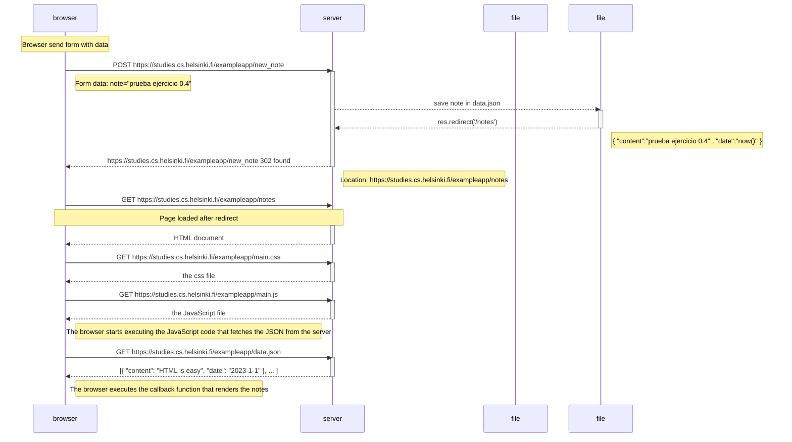

# Ejercicio 0.4
## Diagrama de secuencia para crear una nueva nota en la pagina

```mermaid
sequenceDiagram
    participant browser
    participant server
    participant data.json as file

    Note over browser: Browser send form with data
    browser->>server: POST https://studies.cs.helsinki.fi/exampleapp/new_note
    activate server
    Note right of browser: Form data: note="prueba ejercicio 0.4"
    server-->>file: save note in data.json
    activate file
    file-->>server: res.redirect('/notes')
    deactivate file
    Note right of file: { "content":"prueba ejercicio 0.4" , "date":"now()" }
    server-->>browser: https://studies.cs.helsinki.fi/exampleapp/new_note 302 found
    deactivate server
    Note right of server: Location: https://studies.cs.helsinki.fi/exampleapp/notes
    browser->>server: GET https://studies.cs.helsinki.fi/exampleapp/notes
    Note over browser, server: Page loaded after redirect 
    
    activate server
    server-->>browser: HTML document
    deactivate server

    browser->>server: GET https://studies.cs.helsinki.fi/exampleapp/main.css
    activate server
    server-->>browser: the css file
    deactivate server

    browser->>server: GET https://studies.cs.helsinki.fi/exampleapp/main.js
    activate server
    server-->>browser: the JavaScript file
    deactivate server

    Note right of browser: The browser starts executing the JavaScript code that fetches the JSON from the server

    browser->>server: GET https://studies.cs.helsinki.fi/exampleapp/data.json
    activate server
    server-->>browser: [{ "content": "HTML is easy", "date": "2023-1-1" }, ... ]
    deactivate server

    Note right of browser: The browser executes the callback function that renders the notes
```
