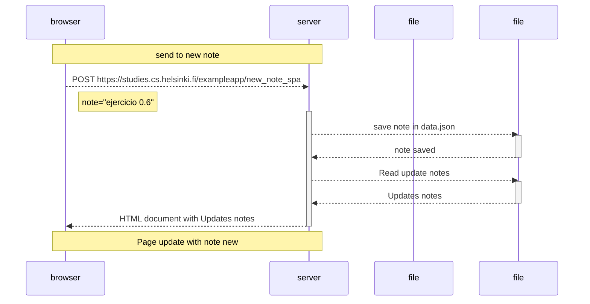

# Ejercicio 0.6
## Diagrama de secuencia ingreso de una nota en aplicacion de una sola pagina

```mermaid
sequenceDiagram
    participant browser
    participant server
    participant data.json as file
    
    Note over browser, server: send to new note
    browser-->>server: POST https://studies.cs.helsinki.fi/exampleapp/new_note_spa
    Note right of browser: note="ejercicio 0.6"

    activate server
    server-->>file: save note in data.json
    activate file
    file-->>server: note saved 
    deactivate file
    server-->>file: Read update notes
    activate file
    file-->>server: Updates notes
    deactivate file

    server-->>browser: HTML document with Updates notes
    deactivate server
    Note over browser, server: Page update with note new
```
